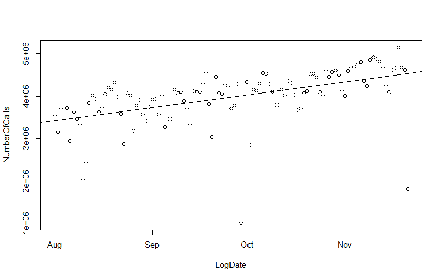
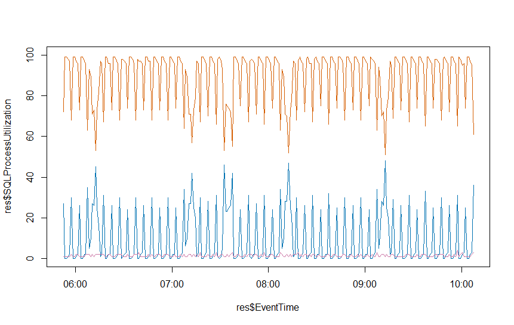
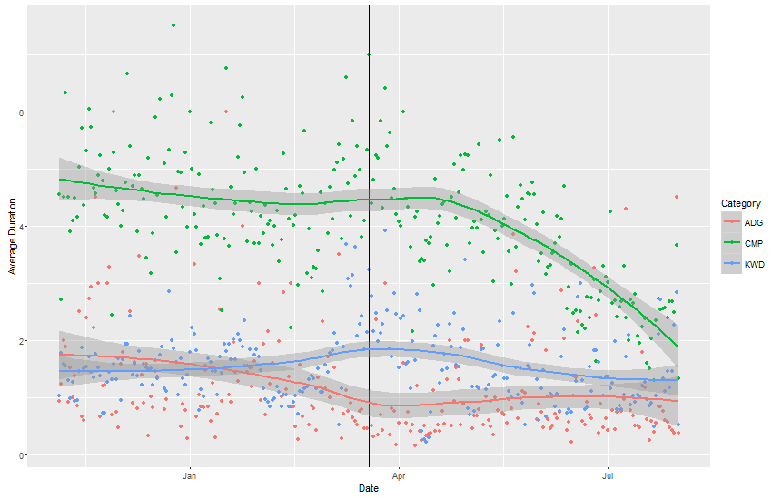
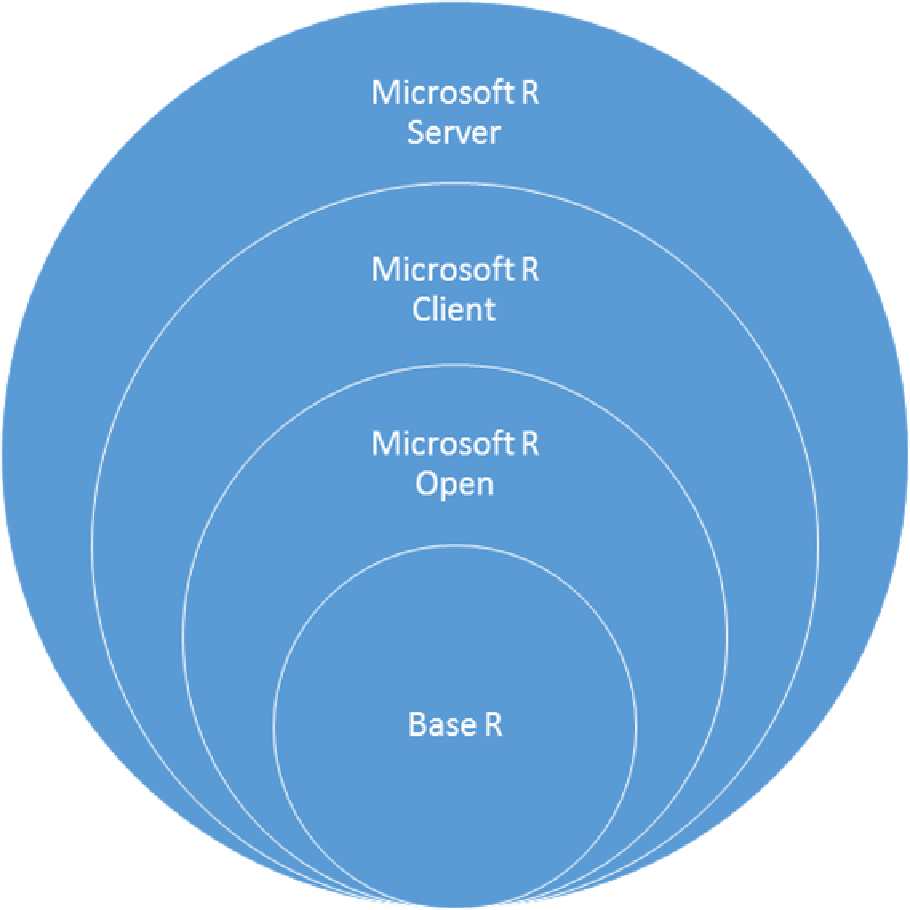

## R for the SQL Server Developer

<a href="http://www.catallaxyservices.com">Kevin Feasel</a> (<a href="https://twitter.com/feaselkl">@feaselkl</a>) 
<a href="http://csmore.info/on/r">http://CSmore.info/on/r</a>

---

@title[Who Am I?]

@div[left-60]
<table>
	<tr>
		<td></td>
		<td><a href="https://csmore.info">Catallaxy Services</a></td>
	</tr>
	<tr>
		<td></td>
		<td><a href="https://curatedsql.com">Curated SQL</a></td>
	</tr>
	<tr>
		<td></td>
		<td><a href="https://www.apress.com/us/book/9781484254608">PolyBase Revealed</a></td>
	</tr>
</table>
@divend

@div[right-40]
	  
	
	 
	<a href="https://www.twitter.com/feaselkl">@feaselkl</a>

@divend

---

### What Is R?

@div[left-50]
R is a language focused around performing statistical analysis, predictive modeling, and data cleansing.

R is an off-shoot of the S language and is built on top of C.
@divend

@div[right-50]

@divend

---?image=presentation/assets/background/1_1_ecosystem.jpg&size=cover&opacity=20

### Why Use R?

As a data analysis Domain Specific Language (DSL):

* R has a large number of built-in functions for performing operations, including aggregates, statistical analysis, and graphing and plotting.
* The R ecosystem is vast, with over 12K packages in CRAN.
* R language constructs make set-based analysis and operation easy.

R helps you go well beyond simple Excel analysis and pivot tables.

---?image=presentation/assets/background/2_2_motivation.jpg&size=cover&opacity=20

### Motivation

My goals in this talk:

* Introduce you to the R ecosystem and language.
* Introduce you to the value of notebooks.
* Get you thinking about ways you could use R today.

Note that R is not the only data analysis language you could learn.  Julia and Python are also great languages, and there are very good closed-source, commercial tools like SAS.

---

### Call Logging

---

### CPU Utilization

---

### Columnstore Improvements

---

@title[Installing R and Tools]

## Agenda
1. **Installing R And Tools**
2. Learning the Basics
3. Connecting to SQL Server
4. Getting A Taste Of R

---?image=presentation/assets/background/2_6_tree.jpg&size=cover&opacity=20

### Getting the Right Version

@div[left-50]

@divend

@div[right-50]
There are two major branches of R of interest to us:  base R and Microsoft R.  "Base" R is managed by the R Consortium and is entirely open-source.  Microsoft takes base R and adds additional libraries and support.
@divend

---?image=presentation/assets/background/2_1_library.jpg&size=cover&opacity=20

@title[Versions]

| Type | Parallelism | Data Size |
| :--- | :---------- | :-------- |
| Base R | Parallel libraries | In-memory |
| Microsoft R Open | MKL w/o ScaleR | In-memory |
| Microsoft R Client | ScaleR, 2 threads | In-memory |
| Microsoft R Server | Full paralleism | Memory or disk |

---?image=presentation/assets/background/2_3_ide.jpg&size=cover&opacity=20

### Choosing An IDE

There is one big IDE available:  RStudio.  RStudio is a standalone installation and provides a nice development interface for R.

Microsoft has also made available R Tools for Visual Studio (RTVS), a Visual Studio plug-in.  It offers some interesting features like making SQL Server R Services integration easier, and it integrates with other Visual Studio projects. It is also built into Visual Studio 2017.

---?image=presentation/assets/background/2_4_jupyter.jpg&size=cover&opacity=35

### Jupyter

We will also install Jupyer Notebooks and use it during this talk.  Installing Jupyter takes a few steps, but the links for this talk include a step-by-step walkthrough.  The easiest way to install Jupyter is to use Anaconda, a data science suite for Python.

Jupyter (which name derives from a combination of the languages Julia, Python, and R) is a great framework because it has support for dozens of languages.  Microsoft uses Jupyter Notebooks for its Azure Machine Learning products.

---?image=presentation/assets/background/2_5_notebook.jpg&size=cover&opacity=20

### Why Notebooks?

Notebooks are a way of mixing Markdown-enabled text and language snippets to make your thoughts clear to others.  You can create and share notebooks, allowing others easily to test your process and follow along.  Notebooks are also an excellent teaching mechanism.

---

@title[Learning the Basics]

## Agenda
1. Installing R And Tools
2. **Learning the Basics**
3. Connecting to SQL Server
4. Getting A Taste Of R

---?image=presentation/assets/background/4_5_demo.jpg&size=cover&opacity=20

### Demo Time

---

@title[Connecting to SQL Server]

## Agenda
1. Installing R And Tools
2. Learning the Basics
3. **Connecting to SQL Server**
4. Getting A Taste Of R

---?image=presentation/assets/background/3_1_connection.jpg&size=cover&opacity=20

### Connecting to SQL Server

Connecting to a SQL Server database (or any other relational database) is easy with R.  The first step is to install the RODBC or DBI pacakage to give your R code ODBC support.  From there, you can connect to a system data source that you've defined in your ODBC Data Sources.

You could also pass in a connection string if you don't want to set up a DSN.

---?image=presentation/assets/background/4_5_demo.jpg&size=cover&opacity=20

### Demo Time

---

@title[Getting a Taste of R]

## Agenda
1. Installing R And Tools
2. Learning the Basics
3. Connecting to SQL Server
4. **Getting A Taste Of R**

---?image=presentation/assets/background/4_1_restaurant.jpg&size=cover&opacity=20

No single talk will expose the full gamut of what you can do with R, but this next section will try to hit a few of the highlights.  If this feels a bit overwhelming, don't fret:  you can grab the notebook and try it out yourself.

This notebook will cover the analysis of restaurant data for Wake County, North Carolina over a multi-year period.

---?image=presentation/assets/background/4_5_demo.jpg&size=cover&opacity=20

### Demo Time

---

### Wrapping Up

R is a powerful language for performing analysis.  We've seen just a few of the many valuable uses of R.

To learn more, go here:  <a href="http://csmore.info/on/r">http://CSmore.info/on/r</a>

And for help, contact me:  <a href="mailto:feasel@catallaxyservices.com">feasel@catallaxyservices.com</a> | <a href="https://www.twitter.com/feaselkl">@feaselkl</a>
